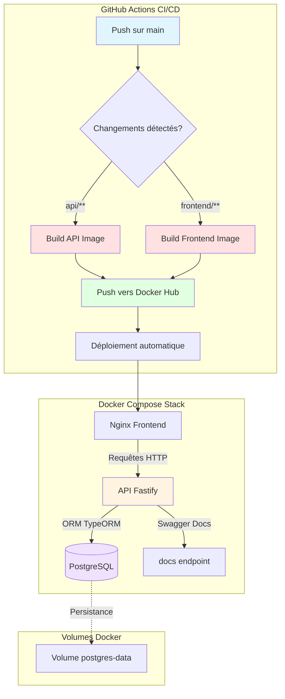
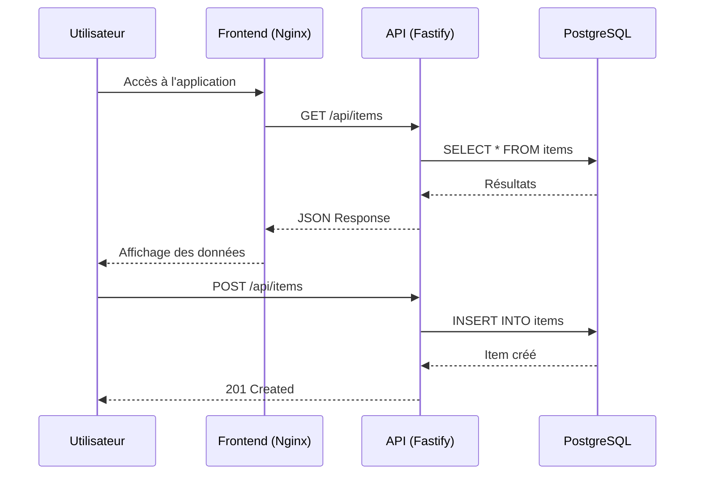
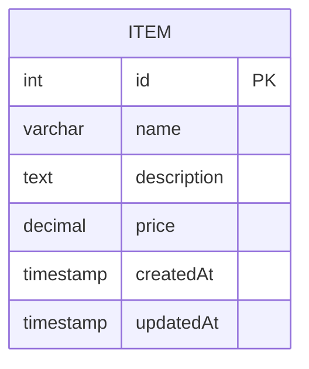
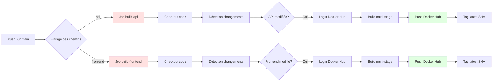

# 📦 TD-COURS - Application Conteneurisée avec CI/CD

## 📋 Table des matières

- [Vue d'ensemble](#vue-densemble)
- [Architecture](#architecture)
- [Technologies utilisées](#technologies-utilisées)
- [Structure du projet](#structure-du-projet)
- [Backend API](#backend-api)
- [Base de données](#base-de-données)
- [Frontend](#frontend)
- [Docker & Orchestration](#docker--orchestration)
- [CI/CD Pipeline](#cicd-pipeline)
- [Installation & Déploiement](#installation--déploiement)
- [Sécurité](#sécurité)
- [Variables d'environnement](#variables-denvironnement)

---

## 🎯 Vue d'ensemble

Ce projet est une application web complète conteneurisée comprenant :
- Une **API REST** développée avec Fastify et TypeScript
- Une **base de données PostgreSQL** pour la persistance des données
- Un **frontend** pour l'interface utilisateur
- Un **pipeline CI/CD** automatisé avec GitHub Actions
- Une **orchestration** complète via Docker Compose

### Objectifs du projet
- ✅ Construire des images Docker optimisées (multi-stage builds)
- ✅ Orchestrer plusieurs services avec Docker Compose
- ✅ Sécuriser l'exécution (utilisateur non-root, healthchecks)
- ✅ Automatiser le déploiement via CI/CD
- ✅ Implémenter les bonnes pratiques DevOps

---

## 🏗️ Architecture



### Flux de données



---

## 🛠️ Technologies utilisées

### Backend (API)

| Technologie | Version | Usage |
|------------|---------|-------|
| **Node.js** | 24.9.0 | Runtime JavaScript |
| **TypeScript** | Latest | Typage statique |
| **Fastify** | Latest | Framework web ultra-rapide |
| **TypeORM** | Latest | ORM pour PostgreSQL |
| **@fastify/swagger** | Latest | Documentation API automatique |
| **@fastify/swagger-ui** | Latest | Interface Swagger UI |
| **@fastify/cors** | Latest | Gestion CORS |

### Base de données

| Technologie | Version |
|------------|---------|
| **PostgreSQL** | Latest |

### DevOps

| Outil | Usage |
|-------|-------|
| **Docker** | Conteneurisation |
| **Docker Compose** | Orchestration multi-services |
| **GitHub Actions** | CI/CD Pipeline |
| **Docker Hub** | Registre d'images |

---

## 📁 Structure du projet

```
TD-COURS/
├── .github/
│   └── workflows/
│       └── docker-publish.yml        # Pipeline CI/CD
├── api/
│   ├── src/
│   │   ├── app.ts                    # Point d'entrée Fastify
│   │   ├── data-source.ts            # Configuration TypeORM
│   │   ├── BaseEntity.ts             # Entité de base
│   │   └── Item.ts                   # Modèle Item
│   ├── Dockerfile.dev                # Dockerfile développement
│   ├── Dockerfile.prod               # Dockerfile production (multi-stage)
│   ├── package.json
│   └── tsconfig.json
├── frontend/
│   ├── Dockerfile.dev
│   ├── Dockerfile.prod
│   └── ...
├── environment/
│   └── .env                          # Variables d'environnement
└── docker-compose.yml                # Orchestration complète
```

---

## 🚀 Backend API

### Architecture de l'API

L'API est construite avec **Fastify**, un framework web Node.js extrêmement performant (jusqu'à 30 000 req/s), offrant :
- ⚡ Performance optimale (plus rapide qu'Express)
- 📝 Validation des schémas intégrée
- 🔌 Système de plugins puissant
- 📚 Documentation Swagger automatique

### Modèle de données



#### Entité Item (TypeORM)

```typescript
@Entity()
export class Item extends BaseEntity {
  @Column({ type: 'varchar', length: 100 })
  name: string;

  @Column({ type: 'text', nullable: true })
  description: string;

  @Column({ type: 'decimal', precision: 10, scale: 2 })
  price: number;
}
```

### Endpoints disponibles

| Méthode | Endpoint | Description | Body |
|---------|----------|-------------|------|
| `GET` | `/api/health` | État de santé de l'API | - |
| `GET` | `/api/status` | Statut et uptime | - |
| `GET` | `/api/items` | Liste tous les items | - |
| `GET` | `/api/items/:id` | Récupère un item par ID | - |
| `POST` | `/api/items` | Crée un nouvel item | `{name, description?, price}` |
| `PUT` | `/api/items/:id` | Met à jour un item | `{name?, description?, price?}` |
| `DELETE` | `/api/items/:id` | Supprime un item | - |
| `GET` | `/docs` | Documentation Swagger UI | - |

### Exemples de requêtes

#### Créer un item
```bash
curl -X POST http://localhost:3000/api/items \
  -H "Content-Type: application/json" \
  -d '{
    "name": "Laptop",
    "description": "MacBook Pro 16\"",
    "price": 2499.99
  }'
```

#### Récupérer tous les items
```bash
curl http://localhost:3000/api/items
```

#### Mettre à jour un item
```bash
curl -X PUT http://localhost:3000/api/items/1 \
  -H "Content-Type: application/json" \
  -d '{
    "price": 2299.99
  }'
```

### Swagger Documentation

L'API expose automatiquement une documentation interactive Swagger UI accessible à l'adresse :
```
http://localhost:3000/docs
```

Cette documentation permet de :
- 📖 Visualiser tous les endpoints disponibles
- 🧪 Tester les requêtes directement depuis l'interface
- 📝 Voir les schémas de validation des données
- 🔍 Explorer les codes de réponse possibles

---

## 🗄️ Base de données

### Configuration PostgreSQL

La base de données PostgreSQL est configurée avec :
- **Initialisation automatique** des schémas via TypeORM
- **Persistance des données** via un volume Docker
- **Healthcheck** pour vérifier la disponibilité

### Connexion via TypeORM

```typescript
export const AppDataSource = new DataSource({
  type: "postgres",
  host: process.env.DB_HOST,
  port: parseInt(process.env.DB_PORT),
  username: process.env.DB_USER,
  password: process.env.DB_PASSWORD,
  database: process.env.DB_NAME,
  synchronize: true,  // ⚠️ Désactiver en production
  logging: false,
  entities: [Item]
})
```

---

## 🐳 Docker & Orchestration

### Dockerfile Multi-stage (API)

Le Dockerfile utilise un **build multi-étapes** pour optimiser la taille de l'image :

```dockerfile
# Stage 1 : Build
FROM node:24.9.0-alpine3.21 AS builder
WORKDIR /app
COPY package*.json ./
RUN npm ci
COPY . .
RUN npm run build

# Stage 2 : Production
FROM node:24.9.0-alpine3.21 AS production
WORKDIR /app
COPY package*.json ./
RUN npm ci --only=production && npm cache clean --force
COPY --from=builder /app/dist ./dist
EXPOSE 3000
CMD ["node", "dist/app.js"]
```

**Avantages du multi-stage :**
- ✅ Réduction de la taille de l'image (pas de devDependencies)
- ✅ Image finale ne contient que le code compilé
- ✅ Couches Docker optimisées (cache efficient)
- ✅ Surface d'attaque réduite (sécurité)

### .dockerignore

```
node_modules
dist
.env
.git
*.md
.vscode
```

### Docker Compose

L'orchestration complète est gérée par Docker Compose :

```yaml
services:
  db:
    image: postgres:latest
    volumes:
      - postgres-data:/var/lib/postgresql/data
    healthcheck:
      test: ["CMD-SHELL", "pg_isready -U ${DB_USER}"]
      interval: 10s
      timeout: 5s
      retries: 5
  
  api:
    build: ./api
    depends_on:
      db:
        condition: service_healthy
    environment:
      - DB_HOST=db
      - DB_PORT=5432
    healthcheck:
      test: ["CMD", "wget", "--spider", "http://localhost:3000/api/health"]
  
  frontend:
    build: ./frontend
    depends_on:
      - api
    ports:
      - "80:80"

volumes:
  postgres-data:
```

---

## ⚙️ CI/CD Pipeline

### Architecture du pipeline



### Workflow GitHub Actions

Le pipeline CI/CD automatise :
1. **Détection des changements** : Utilise `git diff` pour identifier les fichiers modifiés
2. **Build conditionnel** : Ne rebuild que les services modifiés
3. **Build multi-stage** : Utilise les Dockerfiles optimisés
4. **Push vers Docker Hub** : Images taguées avec `latest` et le SHA du commit
5. **Exécution parallèle** : Les jobs API et Frontend s'exécutent simultanément

### Configuration du workflow

```yaml
name: Docker Build and Push

on:
  push:
    branches: [main]
    paths:
      - "api/**"
      - "frontend/**"
      - ".github/workflows/docker-publish.yml"

jobs:
  build-api:
    runs-on: ubuntu-latest
    steps:
      - uses: actions/checkout@v4
        with:
          fetch-depth: 2
      
      - name: Détection changements API
        id: api-changed
        run: |
          if git diff --name-only HEAD^ HEAD | grep -q '^api/'; then
            echo "changed=true" >> $GITHUB_OUTPUT
          fi
      
      - name: Build et Push
        if: steps.api-changed.outputs.changed == 'true'
        uses: docker/build-push-action@v5
        with:
          context: ./api
          file: ./api/Dockerfile.prod
          push: true
          tags: |
            ${{ secrets.DOCKERHUB_USERNAME }}/api-td:latest
            ${{ secrets.DOCKERHUB_USERNAME }}/api-td:${{ github.sha }}
```

### Secrets requis

Configurez ces secrets dans GitHub :
- `DOCKERHUB_USERNAME` : Nom d'utilisateur Docker Hub
- `DOCKERHUB_TOKEN` : Token d'authentification Docker Hub

---

## 🔒 Sécurité

### Bonnes pratiques implémentées

#### 1. Utilisateur non-root

```dockerfile
# Création d'un utilisateur dédié
RUN addgroup -g 1001 -S nodejs && \
    adduser -S nodejs -u 1001
USER nodejs
```

#### 2. Images Alpine Linux

Utilisation de `node:24.9.0-alpine3.21` pour :
- ✅ Taille réduite (~50MB vs ~900MB pour node standard)
- ✅ Surface d'attaque minimale
- ✅ Moins de vulnérabilités potentielles

#### 3. Healthchecks

Chaque service possède un healthcheck pour :
- Détecter les services non disponibles
- Restart automatique en cas de problème
- Dépendances ordonnées au démarrage

#### 4. Variables d'environnement

Toutes les configurations sensibles sont externalisées :
```bash
# Aucun mot de passe en dur dans le code
DB_PASSWORD=${DB_PASSWORD}
```

#### 5. Scan des vulnérabilités

```bash
# Scanner l'image pour les vulnérabilités
docker scout cves <image-name>
```

---

## 🔧 Installation & Déploiement

### Prérequis

- Docker 20.10+
- Docker Compose 2.0+
- Node.js 24.9+ (pour développement local)
- Git

### Déploiement local

#### 1. Cloner le repository

```bash
git clone https://github.com/votre-username/TD-COURS.git
cd TD-COURS
```

#### 2. Configurer les variables d'environnement

```bash
# Créer le fichier .env
cat > environment/.env << EOF
# Base de données
DB_HOST=db
DB_PORT=5432
DB_USER=postgres
DB_PASSWORD=votre_mot_de_passe_securise
DB_NAME=td_database

# API
PORT=3000
NODE_ENV=production
EOF
```

#### 3. Lancer l'application

```bash
# Mode production (images buildées)
docker-compose up -d

# Mode développement (avec hot-reload)
docker-compose -f docker-compose.dev.yml up
```

#### 4. Vérifier le déploiement

```bash
# Vérifier les conteneurs
docker-compose ps

# Consulter les logs
docker-compose logs -f api

# Tester l'API
curl http://localhost:3000/api/health
```

#### 5. Accéder aux services

- **Frontend** : http://localhost
- **API** : http://localhost:3000
- **Swagger UI** : http://localhost:3000/docs
- **Health Check** : http://localhost:3000/api/health

### Commandes utiles

```bash
# Rebuilder les images
docker-compose build --no-cache

# Arrêter les services
docker-compose down

# Supprimer volumes et images
docker-compose down -v --rmi all

# Voir les logs d'un service
docker-compose logs -f api

# Exécuter une commande dans un conteneur
docker-compose exec api sh

# Inspecter la base de données
docker-compose exec db psql -U postgres -d td_database
```

---

## 📊 Variables d'environnement

### API (Backend)

| Variable | Description | Exemple | Obligatoire |
|----------|-------------|---------|-------------|
| `DB_HOST` | Hôte de la base de données | `db` | ✅ |
| `DB_PORT` | Port PostgreSQL | `5432` | ✅ |
| `DB_USER` | Utilisateur PostgreSQL | `postgres` | ✅ |
| `DB_PASSWORD` | Mot de passe PostgreSQL | `secret123` | ✅ |
| `DB_NAME` | Nom de la base | `td_database` | ✅ |
| `PORT` | Port d'écoute de l'API | `3000` | ❌ |
| `NODE_ENV` | Environnement | `production` | ❌ |

### Base de données

| Variable | Description | Exemple |
|----------|-------------|---------|
| `POSTGRES_USER` | Utilisateur admin | `postgres` |
| `POSTGRES_PASSWORD` | Mot de passe admin | `secret123` |
| `POSTGRES_DB` | Base par défaut | `td_database` |

---

## 📈 Monitoring et Logs

### Healthchecks

Tous les services exposent des endpoints de santé :

```bash
# API Health
curl http://localhost:3000/api/health
# Response: {"status":"ok","timestamp":"...","database":"connected"}

# PostgreSQL Health
docker-compose exec db pg_isready -U postgres
```

### Logs centralisés

```bash
# Tous les services
docker-compose logs -f

# Service spécifique
docker-compose logs -f api

# Dernières 100 lignes
docker-compose logs --tail=100 api
```

---

## 🚀 Améliorations futures

### CI/CD
- [ ] Ajouter des tests unitaires automatisés
- [ ] Implémenter Docker Content Trust (signature d'images)
- [ ] Déploiement automatique sur un environnement de staging
- [ ] Notifications Slack/Discord des déploiements

### Monitoring
- [ ] Intégrer Prometheus pour les métriques
- [ ] Ajouter Grafana pour la visualisation
- [ ] Logs centralisés avec ELK Stack
- [ ] Alerting automatique (PagerDuty, Opsgenie)

### Scaling
- [ ] Configuration Kubernetes (K8s)
- [ ] Auto-scaling horizontal
- [ ] Load balancing multi-instances
- [ ] Redis pour le cache

### Sécurité avancée
- [ ] Scan automatique des vulnérabilités (Trivy, Snyk)
- [ ] Secrets management avec Vault
- [ ] Rate limiting sur l'API
- [ ] WAF (Web Application Firewall)

---

## 📝 Difficultés rencontrées

### 1. Pipeline CI/CD
**Problème** : Le workflow ne se déclenchait pas correctement avec les conditions `if` complexes.

**Solution** : Utilisation de `git diff` pour détecter les changements et conditions par step plutôt que par job.

### 2. Healthchecks
**Problème** : Les services démarraient dans le mauvais ordre.

**Solution** : Ajout de `depends_on` avec `condition: service_healthy`.

### 3. TypeORM synchronize
**Problème** : `synchronize: true` peut causer des pertes de données en production.

**Solution** : Utiliser des migrations TypeORM pour la production.

---

## 👥 Contribution

Pour contribuer au projet :

1. Fork le repository
2. Créer une branche (`git checkout -b feature/amelioration`)
3. Commit les changements (`git commit -m 'Ajout fonctionnalité'`)
4. Push vers la branche (`git push origin feature/amelioration`)
5. Ouvrir une Pull Request

---

## 📄 Licence

Ce projet est sous licence MIT.

---

## 📞 Support

Pour toute question ou problème :
- Ouvrir une issue sur GitHub
- Consulter la documentation Swagger : `/docs`
- Vérifier les logs : `docker-compose logs -f`

---

**Développé avec ❤️ dans le cadre du TD Conception d'application conteneurisée**